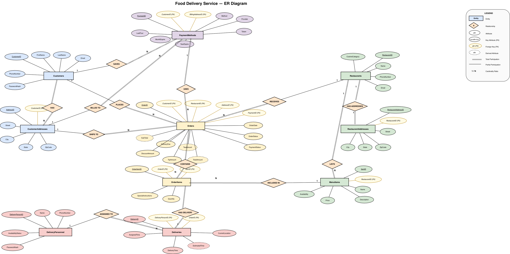

# Food Delivery Service Database

A relational database designed to model a full food delivery platform — from customer accounts and restaurant menus to order processing, payments, and real-time delivery tracking.

Built as part of a Database Management course at CUNY Hunter College.

---

## ER Diagram



---

## Schema Overview

The database consists of 10 tables:

| Table | Description |
|---|---|
| `Customers` | User profiles with contact info |
| `CustomerAddresses` | Multiple saved addresses per customer |
| `PaymentMethods` | Tokenized card and digital wallet storage |
| `Restaurants` | Restaurant profiles and cuisine categories |
| `RestaurantAddresses` | Physical locations per restaurant |
| `MenuItems` | Items with price and availability per restaurant |
| `Orders` | Full order records linking customer, restaurant, address, and payment |
| `OrderItems` | Line items with quantity and special instructions |
| `DeliveryPersonnel` | Driver profiles and availability status |
| `Deliveries` | Delivery assignments with time tracking and live location |

---

## Key Features

- **Customer management** — unique profiles, multiple saved addresses, secure tokenized payment storage
- **Restaurant & menu management** — dynamic menu items with live price and availability updates
- **Order processing** — full lifecycle tracking from `Preparing` → `Out For Delivery` → `Delivered`
- **Financial breakdown** — subtotal, delivery fee, tax, discount, tip, and total per order
- **Delivery tracking** — assigned driver, estimated vs. actual delivery time, current location field

---

## How to Run

1. Make sure you have MySQL installed
2. Open your MySQL client or terminal
3. Run the script:

```bash
mysql -u your_username -p < food_delivary_db_mysql_FINAL.sql
```

Or open the file in MySQL Workbench and execute it directly.

---

## Tech Stack

`MySQL` · `SQL` · `Relational Database Design` · `ER Diagrams`

---

## Team

- Anna Chapko
- Calvin Lin
- Jung Chen
